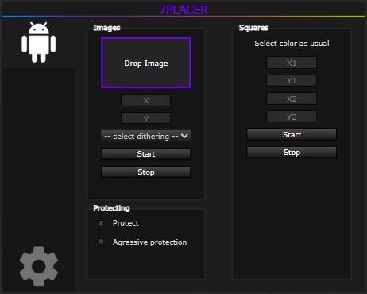

# 7Placer
Fully featured pixelplace.io bot userscript written in Typescript.
##### Are you a user? Install compiled version in greasyfork.
https://greasyfork.org/en/scripts/498043-7placer


## Features

- Processing images into pixels.
- Dithering images
- Fully featured GUI
- Connecting multiple accounts.
- Custom tracker to visualize botting.
- More...



## Developers
```
git clone https://github.com/Aztilux/7Placer
```

Install all requirements.
#### development
the script is in src, change metadata in config.
```
npm run dev
```
`dist/index.dev.user.js`: Install this into tampermonkey in your browser.

`dist/index.debug.js`: This is the development build with eval-source-map. It will be automatically loaded by dist/index.dev.user.js via @require file://.../dist/index.debug.js metadata, Don't add it to your userscript manager.

#### building
```
npm run build
```
`dist/index.prod.user.js` is the final script.

## Contributing

Contributions are very welcome. For other info or speaking with me just join my discord.
https://discord.gg/svE9kRJ6kr or add me @azti.
###### Documentation will come soon™

## Credits
- Azti - main development

#### Special thanks
- @0vc4 - PPClient's drop area style
- @Symmetry - Fixed ping.alive
- @Turuslan - Hacktimer
- @apvarun - toastify-js

